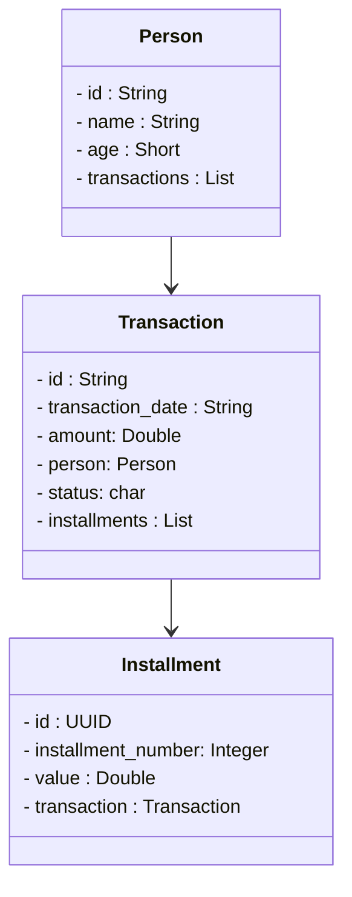

<div   >

# 📋 Microsservico com RabbitMQ e Java

# Hackathon ASAPCARD

 </div>

<div  align="center">
    
    
</div>

## 🚀 Processamento e Envio de Transações

No mundo moderno das transações financeiras e comerciais, a eficiência e a confiabilidade são fundamentais. Um sistema que integra tecnologias como Spring, RabbitMQ, MySQL e Docker oferece uma solução poderosa para lidar com o processamento e o envio de transações de forma eficiente e segura.

## 📶 Tecnologias

- [Spring Boot 3.2.0](https://docs.spring.io/spring-boot/docs/current/reference/htmlsingle/) - Desenvolvida com o poderoso Spring Boot.
- [RabbitMQ 3.12.12-management](https://www.rabbitmq.com/documentation.html) - Middleware de mensageria de código aberto e multiplataforma para comunicação assíncrona.

- [Docker 3.8](https://docs.docker.com/) - Plataforma de virtualização de ambientes, para envio e execução de aplicações em contêineres.
- [MySQL 8 ](https://www.sqlite.org/index.html) - Sistema de gestão de banco de dados SQL confiável e amplamente utilizado.
<br>
<br>
 <hr>
 <br>

<div  align="center"> 

# 🔎 Fluxograma do Projeto


 </div>
 
 <br>
- Arquitetura: Segue o padrão MVC com uma abordagem Web Spring API.

- Dependências: Incluem Spring Web, Spring Boot Devtools, Validation, Spring Data JPA, MySQL Driver, MySQL, RabbitMQ, OpenCSV.

## 💾 Setup

-  Clone o repositorio
```bash
git clone https://github.com/GrazielleNascimento/hackathon-asapcard-pikachu
```

## Instalação 

Docker desktop


- **Instalação do docker:** `'https://www.docker.com/products/docker-desktop/'`

apos a instalação do Docker:

acessar a pasta docker no projeto:

```bash
cd hackathon-asapcard-pikachu
/docker/
```

ao acessar a pasta docker:

```bash
docker compose up -d
```


## 💡Executando o RabbitMQ


- Acesse o RabbitMQ

```bash
http://localhost:15672/
```

```bash
Username:
guest
```

```bash
Password:
guest
```


##  

## 📍 Testando a aplicação

#### Produtor: 

- Rode o sistema Produtor

- Inicie o aplicativo Insomnia no seu computador (ou outro gerenciador de requisições).

- Crie uma Nova Requisição do Tipo 'POST':

- Envie primeiramente o post vazio para /datadto

/datadto = envia o dataDTO para a fila transactionsQueue
- **Base URL:** `'http://localhost:8080/datadto'` 

- execute o método post abaixo apenas se o consumidor já tiver lido as transactions

/statusdto = envia o StatusDTO para a fila statusQueue
- **Base URL:** `'http://localhost:8080/statusdto'` 

#### Consumidor:

- Altere o application.properties e mude o username e password de acordo com o seu banco de dados mySQL

- Rode o sistema Consumidor

- O sistema irá ler toda as filas. É importante que apenas a fila de transactions seja lida neste momento.

- Crie uma Nova Requisição do Tipo 'Get':

- transaction/all/ =  retorna todas as transações, neste momento elas ainda estão pendentes

- após toda fila de transações for salva no programa, agora é a hora de receber todas os Status. Rode novamente o produtor, e dessa vez use o caminho /statusdto no insomnia para enviar os status no rabbit.

- execute o consumidor e aguarde o programa atualizar o status de todas transações.

- transaction/all/{status} =  retorna todas as transações de acordo com o status passado do PathVariable.
  Exemplo: transaction/all/c = busca todos confirmados a partir do status C

c - processamento concluido  <br>
n - processamento negado  <br>
p - processamento pendente  <br>

## Diagrama de Classes




## 😎 Colaboradores

- [Felipe Macedo](https://github.com/FelipeAJdev)

- [Grazielle Nascimento Ferreira](https://github.com/GrazielleNascimento)

- [Luis Felipe Sibim](https://github.com/lfsibim)

- [Pedro Soares](https://github.com/Pedro-Musart)

- [Rodrigo Schort](https://github.com/RodrigoSchort)

<br />


